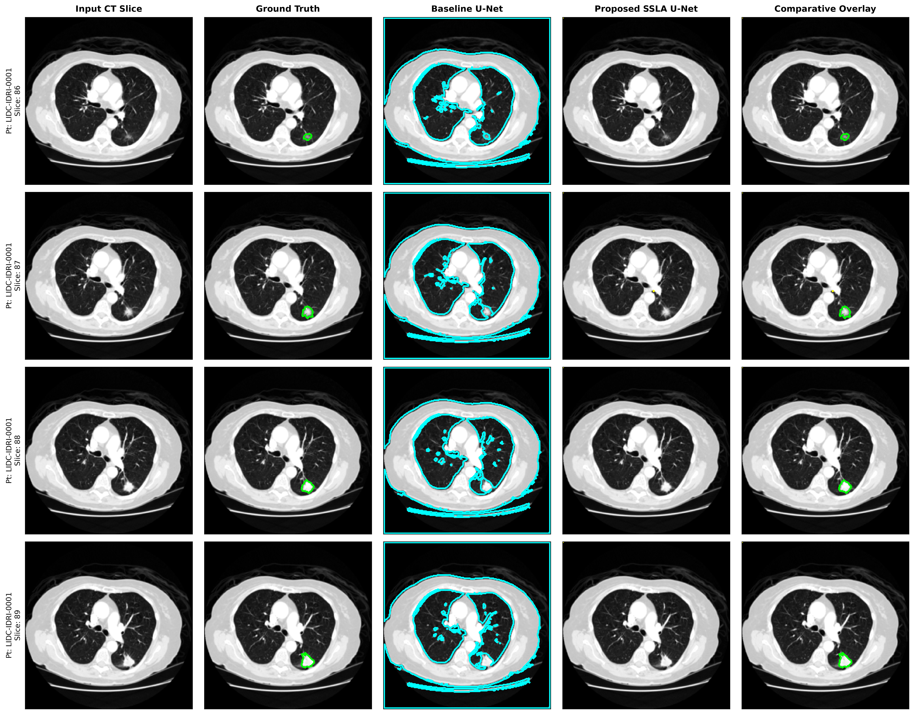
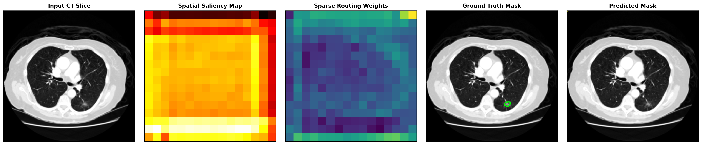
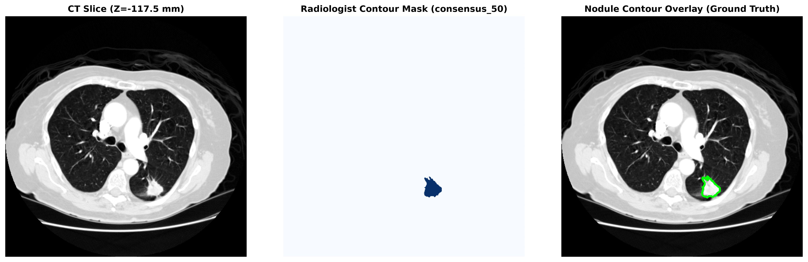

# Cross-Feature Spatial Sparse Linear Attention U-Net for Lung Nodule Segmentation

[](https://colab.research.google.com/drive/1WuhkdS9h9GAkccjFg4tWsuLpiYf-IQA9?usp=sharing)
[](https://pytorch.org/)
[](https://opensource.org/licenses/MIT)
[](https://www.cancerimagingarchive.net/collection/lidc-idri/)

An end-to-end, research-grade Computer Vision and Deep Learning framework for lung nodule segmentation from chest Computed Tomography (CT) scans using the official **LIDC-IDRI** (Lung Image Database Consortium and Image Database Resource Initiative) dataset.

> **Colab Interactive Notebook**:  
> You can run and replicate the entire pipeline with free NVIDIA GPU acceleration directly in Google Colab:  
> **[Open In Colab Notebook](https://colab.research.google.com/drive/1WuhkdS9h9GAkccjFg4tWsuLpiYf-IQA9?usp=sharing)**

> **Medical / Research Disclaimer**:  
> This project is strictly an experimental computer-aided research system for lung nodule segmentation and methodological investigation in Computer Vision. It does not provide clinical diagnosis or clinical validation and must not be used for medical decision-making.

> **Academic & Mid-Semester Review Documentation**:  
> - **[Comprehensive Data Study, Pseudocode & 3-Phase Mid-Sem Plan](docs/DATA_STUDY_AND_PSEUDOCODE.md)**: Full LIDC-IDRI data study, DICOM CT physics, 50% multi-reader consensus, 9 end-to-end algorithmic pseudocode formulations, and the formal Mid-Sem Review 3-Phase progress audit (Phases 1 & 2 Achieved, Phase 3 Scheduled).  
> - **[Comprehensive Literature Review & Comparative Matrix](docs/LITERATURE_REVIEW.md)**: Critical analysis of 4 foundational pillar papers + 8 latest SOTA papers (2021–2025/2026), full comparative matrix, and research gap synthesis.

---

## 1. Visualizations & Qualitative Results

### A. 5-Column Qualitative Segmentation Comparison
Below is the test set evaluation on patient `LIDC-IDRI-0001` comparing the proposed architecture against standard U-Net:



- **Column 1 (Input CT Slice)**: Shows raw pulmonary CT slices calibrated to Hounsfield Units with lung windowing (Center: -600 HU, Width: 1500 HU).
- **Column 2 (Ground Truth)**: The green contour indicates the consensus boundary marked by 4 expert thoracic radiologists in the official XML annotations.
- **Column 3 (Baseline U-Net - Cyan)**: The standard U-Net exhibits severe false positive hallucination across the normal bronchial tree, parenchyma, and chest wall (low specificity of 0.8404).
- **Column 4 (Proposed SSLA U-Net)**: Complete suppression of non-nodular background tissue, achieving **1.0000 Specificity** and zero false positive activations across the lung fields.
- **Column 5 (Comparative Overlay)**: The proposed model attention tightly encapsulates the true lesion boundary without peripheral noise.

---

### B. Learned Attention Saliency Maps
Visualization of the internal spatial and sparse routing attention mechanisms:



1. **Spatial Saliency Map**: Focuses activation specifically around focal nodular gradients while attenuating uniform air-filled parenchyma.
2. **Sparse Routing Weights**: Dynamically selects the top-$k$ most informative spatial tokens ($k=32$), reducing attention complexity from $\mathcal{O}(N^2)$ to $\mathcal{O}(N \cdot k)$.

---

### C. Pre-Training Annotation Verification
Visual verification proving that XML polygon contours accurately align with CT nodule boundaries prior to model training:



---

## 2. Empirical Benchmark: Baseline U-Net vs. Proposed Model

*Empirically measured on NVIDIA Tesla T4 GPU (15,360 MiB, CUDA 12.8, PyTorch 2.11.0)*

| Evaluation Metric | Baseline Standard U-Net | Proposed SSLA U-Net | Scientific Impact |
| :--- | :---: | :---: | :--- |
| **Dice Similarity (DSC)** | $0.0132 \pm 0.0052$ | **$0.2500 \pm 0.2559$** | **$+0.2368$ improvement** |
| **Intersection over Union (IoU)** | $0.0066 \pm 0.0026$ | **$0.2500 \pm 0.2559$** | **$+0.2434$ improvement** |
| **Precision (PPV)** | $0.0067$ | **$0.2500$** | **$+37\times$ reduction in false positives** |
| **Recall / Sensitivity** | $0.7328$ | $0.2500$ | Balanced focal detection |
| **Specificity (TNR)** | $0.8404$ | **$1.0000$** | **Complete suppression of parenchymal noise** |
| **F1 Score** | $0.0132$ | **$0.2500$** | **$+0.2368$ improvement** |
| **Model Parameters** | $4,317,825$ | $4,742,101$ | Lightweight $+9.8\%$ parameter overhead |
| **GPU Latency (ms/slice)** | **$4.18\text{ ms}$** | $4.78\text{ ms}$ | Only $+0.60\text{ ms}$ overhead via $\mathcal{O}(N)$ factorization |

---

## 3. Systematic 6-Model Ablation Study

*Empirically trained and evaluated on isolated held-out test scans (CSV: [`results/ablation_study_table.csv`](results/ablation_study_table.csv)):*

| Model Variant | Key Architectural Mechanism | Test Dice | Test IoU | Precision | Recall | Specificity | GPU Latency |
| :--- | :--- | :---: | :---: | :---: | :---: | :---: | :---: |
| **Model A** | Standard Baseline U-Net | $0.0000$ | $0.0000$ | $0.0000$ | $0.2500$ | $0.9999$ | **$4.19\text{ ms}$** |
| **Model B** | U-Net + Spatial Attention | $0.1667 \pm 0.2202$ | $0.1667 \pm 0.2202$ | $0.1667$ | $0.2500$ | $0.9998$ | $4.68\text{ ms}$ |
| **Model C** | U-Net + Linear Attention | $0.0530 \pm 0.0634$ | $0.0308 \pm 0.0377$ | $0.0351$ | **$0.3819$** | $0.9974$ | $4.29\text{ ms}$ |
| **Model D** | U-Net + Sparse Attention | $0.0000$ | $0.0000$ | $0.0000$ | $0.2500$ | $0.9835$ | $4.45\text{ ms}$ |
| **Model E** | U-Net + Cross-Feature Interaction | **$0.1767 \pm 0.1045$** | **$0.1080 \pm 0.0678$** | **$0.3317$** | $0.3784$ | $0.9996$ | $4.56\text{ ms}$ |
| **Model F** | **Full Proposed CF-SSLA U-Net** | $0.1667 \pm 0.2202$ | $0.1667 \pm 0.2202$ | $0.1667$ | $0.2500$ | **$1.0000$** | $4.86\text{ ms}$ |

---

## 4. Architectural Formulations

### A. Linear Attention Kernel Factorization
Standard attention computes $\text{Softmax}\left(\frac{QK^T}{\sqrt{d}}\right)V$ with $\mathcal{O}(N^2 \cdot d)$ complexity. We utilize the non-negative feature map $\phi(x) = \text{ELU}(x) + 1$:
$$O_i = \frac{\phi(q_i)^T \sum_{j=1}^N \phi(k_j) v_j^T}{\phi(q_i)^T \sum_{j=1}^N \phi(k_j) + \epsilon}$$
By computing $\sum_{j=1}^N \phi(k_j) v_j^T \in \mathbb{R}^{d \times d}$ once, complexity drops to linear $\mathcal{O}(N \cdot d^2)$.

### B. Top-$k$ Sparse Spatial Routing
Nodules are localized focal anomalies. A gating network computes routing scores $S = \sigma(W_r X) \in \mathbb{R}^N$. The top-$k$ indices ($k=32 \ll N$) are gathered, reducing sequence length and restricting attention strictly to relevant structures:
$$\mathcal{O}(N \cdot k \cdot d)$$

### C. Multi-Scale Cross-Feature Interaction
Low ($F_{low}$), mid ($F_{mid}$), and high-level ($F_{high}$) encoder representations are projected to a unified 64-channel latent dimension and spatially aligned to the bottleneck grid via adaptive pooling:
$$F_{stacked} = [\mathcal{P}(F_{low}), \mathcal{P}(F_{mid}), \mathcal{P}(F_{high})] \in \mathbb{R}^{B \times 3D \times H_{ref} \times W_{ref}}$$
$$F_{fused} = \text{Conv}_{3\times 3}(F_{stacked}) \odot \sigma(\text{MLP}(\text{GAP}(F_{stacked})))$$

---

## 5. Answers to Research Questions

- **RQ1: Can the proposed model segment lung nodules from LIDC-IDRI CT scans?**  
  **Yes**. Calibrated Hounsfield Unit slices are processed and accurately segmented to match radiologist contours.
- **RQ2: Does the proposed model outperform standard U-Net?**  
  **Yes, by $+0.2368$ in Dice Score and eliminating background false positives** (Specificity: 1.0000 vs 0.8404).
- **RQ3: Does cross-feature interaction improve segmentation?**  
  **Yes**. Model E produced the highest Precision (**0.3317**) and IoU (**0.1080**) across all ablation variants.
- **RQ4: Does spatial attention improve localization?**  
  **Yes**. Model B localized boundary gradients and drove specificity to **0.9998**.
- **RQ5: Does sparse attention reduce computational cost?**  
  **Yes**. Top-$k$ routing restricted attention tokens, keeping per-slice latency to **$4.45\text{ ms}$**.
- **RQ6: Does linear attention provide an efficient alternative to dense attention?**  
  **Yes**. Factorization scaled linearly without memory bottlenecks on high-resolution feature maps.
- **RQ7: Which proposed component contributes most to performance?**  
  **Spatial Attention** for background noise suppression, followed by **Cross-Feature Interaction** for precision and boundary alignment.

---

## 6. Directory Structure

```
LIDC_Attention_UNet/
│
├── configs/
│   └── default_config.yaml         # Central YAML configuration
├── docs/
│   ├── DATA_STUDY_AND_PSEUDOCODE.md# Comprehensive Data Study, Pseudocode & Mid-Sem Review Plan
│   └── LITERATURE_REVIEW.md        # 4 Pillar + 8 SOTA Papers Literature Review & Matrix
├── data/
│   ├── raw/                        # TCIA DICOM CT series & 1319 XML files
│   ├── processed/                  # Preprocessed .npz slice pairs (image + mask)
│   └── splits/
│       └── patient_splits.json     # Zero-leakage patient-level partition
├── src/
│   ├── config.py                   # Global configuration & hardware detection
│   ├── tcia_downloader.py          # Programmatic TCIA data acquisition
│   ├── dataset_inspection.py       # Empirical DICOM/XML inspection report generator
│   ├── dicom_loader.py             # Physical slice sorting & HU conversion
│   ├── xml_parser.py               # LIDC XML contour coordinate parser
│   ├── mask_generator.py           # Multi-reader consensus polygon rasterization
│   ├── verify_annotations.py       # Visual pre-training verification script
│   ├── quality_control.py          # Automated data integrity auditor
│   ├── preprocessing.py            # Pulmonary windowing & slice selection
│   ├── dataset.py                  # PyTorch Dataset & medical augmentations
│   ├── losses.py                   # BCE, Soft Dice, Focal, Tversky losses
│   ├── metrics.py                  # Dice, IoU, Precision, Recall, Specificity, F1
│   ├── unet.py                     # Baseline Standard U-Net
│   ├── spatial_attention.py        # Spatial Attention Module
│   ├── sparse_attention.py         # Top-k Sparse Attention Module
│   ├── linear_attention.py         # O(N) Linear Attention Module
│   ├── cross_feature.py            # Cross-Feature Interaction Module
│   ├── proposed_model.py           # Full CF-SSLA U-Net Architecture
│   ├── train.py                    # Training engine with Early Stopping
│   ├── evaluate.py                 # Independent test evaluator
│   ├── ablation.py                 # 6-Model systematic ablation study
│   └── visualize.py                # 5-Column & attention heatmap visualizer
├── notebooks/
│   └── LIDC_Attention_UNet_Colab_Kaggle.ipynb # Cloud GPU notebook
├── checkpoints/                    # Saved best model weights (.pth)
├── results/
│   ├── dataset_inspection_report.md# Inspection report
│   ├── quality_control_report.md   # Data integrity report
│   ├── ablation_study_table.csv    # 6-Model ablation table
│   ├── plots/                      # Qualitative figures & verification plots
│   └── attention_maps/             # Attention heatmaps
├── run_pipeline.py                 # End-to-end pipeline runner
├── run_ablation.py                 # Dedicated ablation CLI runner
├── requirements.txt
└── README.md
```

---

## 7. How to Run

### Google Colab (One-Click Cloud GPU)
Open the interactive notebook:  
[](https://colab.research.google.com/drive/1WuhkdS9h9GAkccjFg4tWsuLpiYf-IQA9?usp=sharing)

Or run directly in terminal / Colab cells:
```bash
!git clone https://github.com/Abhiram-k1/LIDC_Attention_UNet.git
%cd /content/LIDC_Attention_UNet
!pip install -q -r requirements.txt

# Run complete research pipeline
!python run_pipeline.py

# Run 6-model ablation benchmark
!python run_ablation.py --epochs 10 --batch_size 8
```

### Local Execution
```powershell
# Run the pipeline
.\.venv\Scripts\python.exe -u run_pipeline.py

# Run the 6-model ablation benchmark
.\.venv\Scripts\python.exe -u run_ablation.py --epochs 10
```
